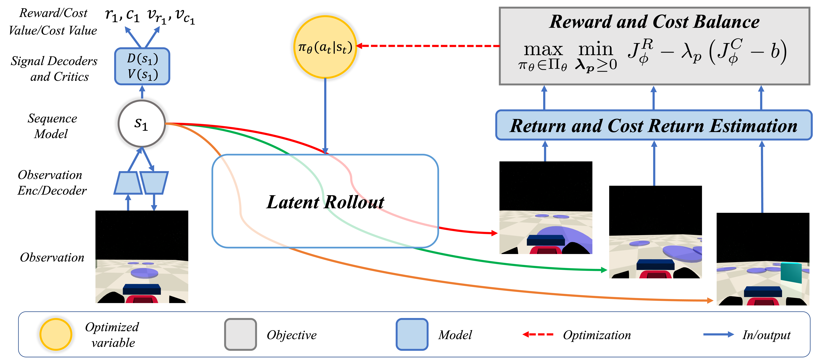

# SafeDreamer

This repository contains the implementation of SafeDreamer.

We introduce a novel algorithm SafeDreamer, incorporating the Lagrangian-based methods into world model planning processes within the superior Dreamer framework. Our method achieves nearly zero-cost performance on various tasks, spanning low-dimensional and vision-only input, within the Safety-Gymnasium benchmark, showcasing its efficacy in balancing performance and safety in RL tasks.




# Instructions

## Step0: Git clone
```sh
git clone https://github.com/Safe-Dreamer/SafeDreamer.git
cd SafeDreamer
```

## Step1: Check version of CUDA and CUDNN
Due to the strong dependency of JAX on CUDA and cuDNN, it is essential to ensure that the versions are compatible to run the code successfully. Before installing JAX, it is recommended to carefully check the CUDA and cuDNN versions installed on your machine. Here are some methods we provide for checking the versions:

1. Checking CUDA version:
- Use the command `nvcc --version` in the terminal to check the installed CUDA version.

2. Checking cuDNN version:
- Check the version by examining the file names or metadata in the cuDNN installation directory 'cat /usr/local/cuda/include/cudnn_version.h | grep CUDNN_MAJOR -A 2'.
- Or you can also use torch to check the CUDNN version 'python3 -c 'import torch;cudnn_version = torch.backends.cudnn.version();print(f"CUDNN Version: {cudnn_version}");print(torch.version.cuda)'

It is crucial to ensure that the installed CUDA and cuDNN versions are compatible with the specific version of JAX you intend to install.
## Step2: Install jax
Here is some subjections for install jax, the new manipulation should be found in [jax][jax] documentation.

### Automatic Installation
```sh
conda create -n example python=3.8
conda activate example
pip install --upgrade pip

# CUDA 12 installation
# Note: wheels only available on linux.
pip install --upgrade "jax[cuda12_pip]" -f https://storage.googleapis.com/jax-releases/jax_cuda_releases.html

# CUDA 11 installation
# Note: wheels only available on linux.
pip install --upgrade "jax[cuda11_pip]" -f https://storage.googleapis.com/jax-releases/jax_cuda_releases.html
```

### Manual Installation

### 
```sh
pip install --upgrade pip
# Installs the wheel compatible with CUDA 12 and cuDNN 8.8 or newer.
# Note: wheels only available on linux.
pip install --upgrade "jax[cuda12_local]" -f https://storage.googleapis.com/jax-releases/jax_cuda_releases.html
```
```sh
# Installs the wheel compatible with CUDA 11 and cuDNN 8.6 or newer.
# Note: wheels only available on linux.
pip install --upgrade "jax[cuda11_local]" -f https://storage.googleapis.com/jax-releases/jax_cuda_releases.html
```

```sh
# Installs the wheel compatible with Cuda 11.4+ and cudnn 8.2+ (deprecated).
pip install "jax[cuda11_cudnn82]" -f https://storage.googleapis.com/jax-releases/jax_cuda_releases.html
```

## Step3: Install Other Dependencies
```sh
pip install -r requirements.txt
```

## Step4: Install Safetygymnasium
```sh
pip install safety-gymnasium
```

## Step5: Execution
```sh
# Online Safety-Reward Planning (OSRP):
python SafeDreamer/train.py --configs osrp --method osrp --task safetygym_SafetyPointGoal1-v0 --jax.logical_gpus 0

# Online Safety-Reward Planning with Lagrangian (OSRP-Lag):
python SafeDreamer/train.py --configs osrp_lag --method osrp_lag --task safetygym_SafetyPointGoal1-v0 --jax.logical_gpus 0

# Background Safety-Reward Planning with Lagrangian (BSRP-Lag):
python SafeDreamer/train.py --configs bsrp_lag --method bsrp_lag --task safetygym_SafetyPointGoal1-v0 --jax.logical_gpus 0

# Online Safety-Reward Planning (OSRP) for low-dimensional input:
python SafeDreamer/train.py --configs osrp_vector --method osrp_vector --task safetygymcoor_SafetyRacecarGoal1-v0 --jax.logical_gpus 0

```

## Step6: Evaluation after Training
```sh
python SafeDreamer/train.py --configs bsrp_lag --method bsrp_lag --run.script eval_only --run.from_checkpoint checkpoint_path  --task safetygym_SafetyPointGoal1-v0 --jax.logical_cpus 0 --run.steps 10000
```

where checkpoint_path is '/xxx/xxx.ckpt'.

# Tips

- All configuration options are documented in `configs.yaml`, and you have the ability to override them through the command line.
- If you encounter CUDA errors, it is recommended to scroll up through the error messages, as the root cause is often an issue that occurred earlier, such as running out of memory or having incompatible versions of JAX and CUDA.
- To customize the GPU memory requirement, you can modify the `os.environ['XLA_PYTHON_CLIENT_MEM_FRACTION']` variable in the `jaxagent.py`. This allows you to adjust the memory allocation according to your specific needs.


# References

[1] [Safety-Gymnasium][safety-gymnasium]

[jax]: https://github.com/google/jax#pip-installation-gpu-cuda
[safety-gymnasium]: https://github.com/PKU-Alignment/safety-gymnasium
